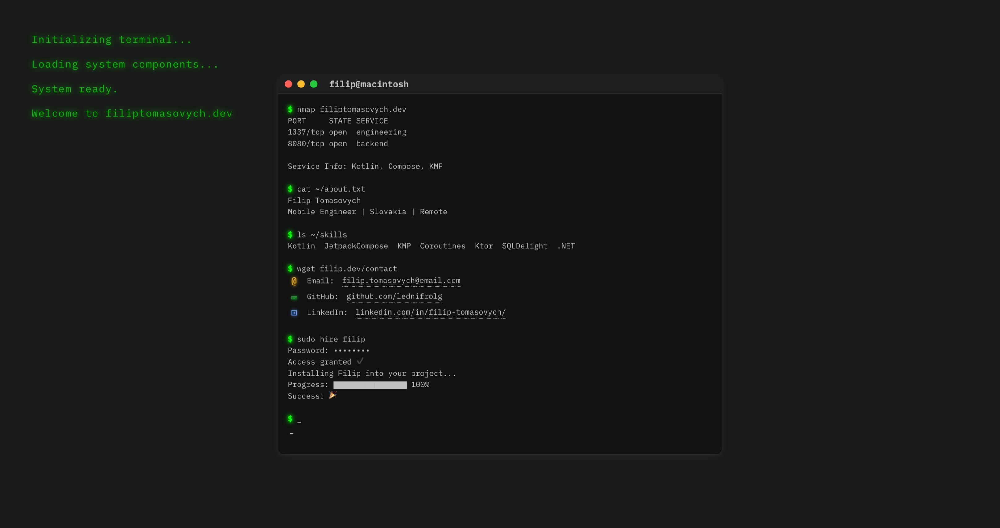

# Terminal Page

A React application that simulates a terminal interface with a bootup sequence animation and typing effect.



## Setup

### Prerequisites

- Node.js (latest LTS version)
- npm or yarn

### Quick Start

```bash
# Install dependencies
npm install

# Start development server
npm run dev
```

The development server will start at `http://localhost:5173`.

## Build

```bash
npm run build
```

## Deployment

This project is configured for GitHub Pages deployment.

### Manual Deployment

To manually deploy to GitHub Pages:

```bash
npm run deploy
```

This will build the project and deploy it to the `gh-pages` branch of your repository.

### Automated Deployment

This project includes a GitHub Actions workflow that automatically deploys the site to GitHub Pages when changes are pushed to the main branch.

The workflow configuration is located in `.github/workflows/deploy.yml`.

## License

MIT License - see the [LICENSE](LICENSE) file for details.

## Author

**Filip Tomasovych**
